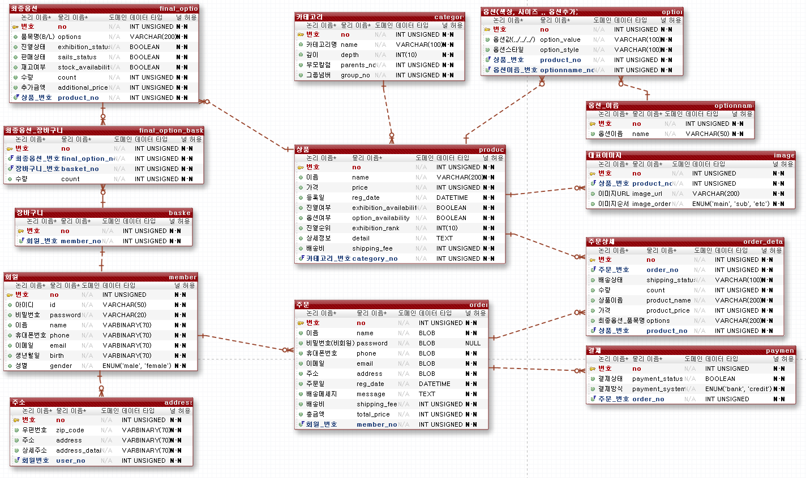

# DB Encryption

## DB 암호화가 필요한 테이블

`개인정보가 담긴 테이블들...`

1. 회원 (member) 테이블

2. 주문 (order) 테이블

이렇게 두가지가 개인정보를 담고 있기 때문에

암호화가 필요하다고 생각한다.

## 암호화의 종류

### 단방향 암호화와 양방향 암호화

#### 1. 단방향 암호화
  암호화는 가능하지만 복호화는 불가능

  이러한 경우 - "패스워드"

  결과 - 패스워드 DB가 털려도 안전

  패스워드 검증 - 입력받은 암호를 똑같은 방식으로 암호화 하여 암호화된 패스워드끼리 비교를 하면 된다.
  ``
  평문 -> 암호화엔진 -> 암호문
  ``

##### 단방향 암호화 종류

1. MD5

- 현재는 안전하지 않으므로 사용X

2. SHA1계열

- 역시 안전X

3. SHA2계열 (SHA256 등)

- 최소 SHA256을 사용하여 암호화 하도록 권장하고 있다.

#### 2. 양방향 암호화
  암호화, 복호화 둘다 가능

이러한 암호화들을 사용할려면 데이터 타입을 <b style='color:blue;'>BLOB()</b>으로 잡아줘야 한다.
varchar나 text 같은 경우 단순 문자열을 저장하는 type이기때문에 암호화 함수를 사용할 경우 incorrect string value 에러가 발생할 수 있습니다. 그 이유는 Mariadb에서 제공하는 몇몇 암호화 함수들은 임의의 byte 값을 반환하기 때문에 단순히 string을 저장하는 text나 varchar 같은 경우 에러가 발생합니다.

대칭키암호화(AES)
평문 -> 암호화(대칭키) -> 암호문 -> 복호화(대칭키) -> 평문
=> 특징 : 암/복호화에 다 사용되는 대칭키를 전달해야함
         속도는 빠름

비대칭키 암호화 (RSA, ECC)
평문 -> 암호화(공개키) -> 암호문 -> 복호화(개인키) -> 평문
=> 특징 : 속도 느림
          암호화는 공개키로 복호화는 개인키로
          여기서 공개키와 개인키 위치가 바뀌면 그게 바로 "전자서명"

##### 대칭키(비밀키)와 비대칭키(공개키)

1. 대칭키(비밀키)

- 송신자와 수신자가 같은 키로 암호화와 복호화를 진행한다.

- 하나의 키로 암호화하고 그와 같은 키로 복호화를 진행하기 때문에 대칭키라고 한다.
또한 이 키는 <B style='color:red;'>외부에 노출되어서는 안되므로 비밀키</b>라고도 한다.

`대칭키(비밀키) 암호화 종류`

1. DES

2. AES

2. 비대칭키(공개키)

- 송신자는 외부에 공개된키(Public Key)로 암호화하여 송신하고 수신자는 개인키(Private Key)로 복호화한다.

- 송신자와 수신자가 사용하는 키가 다르므로 비대칭키라고 한다.

`비대칭키(공개키) 암호화 종류`

1. RSA

2. 전자서명

## 그래서 어떻게 할거냐?

#### 회원테이블

- 아이디 => 양

- 비밀번호 => 단

- 이름 => 양

- 휴대폰번호 => 양

- 이메일 => 양

- 생년월일 => 양

- 성별 => 양

#### 주문테이블

- 이름 => 양

- 비밀번호(비회원) => 단

- 휴대폰번호 => 양

- 이메일 => 양

- 주소 => 양
