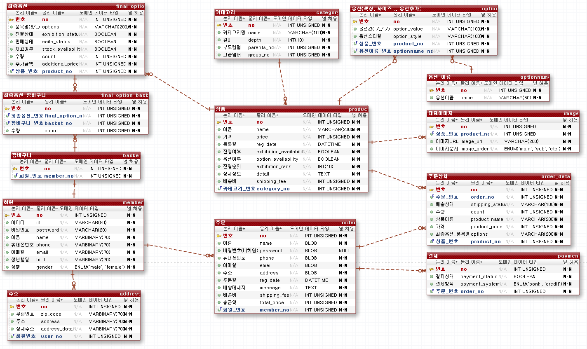

# 테이블 명세서
----------------------------------
## 01. 테이블 관계

#### 카테고리 - 상품

- `카테고리 등록`
카테고리를 등록하기 위해선 일단 카테고리명이 필요하고 깊이, 부모칼럼, 그룹넘버가 필요한데
깊이는 카테고리에서도 대, 중, 소분류를 나누기 위해 넣었고 부모칼럼은 같은 그룹에서
부모를 찾기 위해 등록을 하였고 그룹넘버는 그룹을 지을려고 만들었다.

#### 옵션 - 상품 - 최종옵션

- `상품등록`
옵션에 1차적으로 상품등록을 하고 카디션곱으로 전체 경우의 수를 구한뒤
최종적으로 판매자의 재고에 없는것들을 제외한 결과들을 최종옵션 테이블에 저장을 한다.

#### 상품 - 대표이미지

- `대표이미지 등록`
상품의 이미지등록을 위해서 대표이미지 테이블을 만들어주었다.
그리고 상품에는 detail이라는 DataType: TEXT 형을 만들어 놓고
상세정보들은 이미지와, 텍스트들을 다 포함하고 있는 html 파일을
저장하기로 했다. 그리고 대표이미지 테이블에는 main으로 보여줄 수
있는 이미지URL을 담을 수 있는 테이블을 만들어 주었다. 그리고 이미지순서를
ENUM 타입으로 잡아서 대표중에서도 Main, Sub, Etc 등으로 나눌 수 있게
만들어 주었다.

#### 회원 - 최종옵션 - 최종옵션_장바구니 - 장바구니_번호

- `장바구니 추가`
회원은 장바구니와 1대1 관계이다.
장바구니에 추가하기 위해선 최종옵션(상품) 테이블과 장바구니 테이블이
필요한데 한 장바구니가 여러 상품을 담을 수 있고 한 상품이 여러 장바구니에
담길 수 있기 때문에 다대다 관계가 된다. 그래서 중간에 최종옵션_장바구니 테이블을
놔두어서 다대다관계를 풀어주었다. 그래서 최종적으로 최종옵션_장바구니를 이용해
장바구니를 활용할 수 있게 해주었다.

#### 주문 - 주문상세 - 상품 - 장바구니

- `장바구니에서 주문하기`
장바구니에 담은 물품들을 주문하는 경우엔 주문하기 버튼을 누르면
관계를 통해서 주문상세 테이블에 만들어 지는것 보단 관계를 맺지 않고
직접 넣어주는게 더 좋다고 생각했다. 왜냐하면 장바구니와 주문에 관계를 맺게 되면
사용자가 주문을 완료했고 결제까지 되어 배송중인 상태에 사용자가 장바구니에 상품을
담으면 주문서도 바뀌기 때문에 관계를 끊어주었고 그리고 또 한가지 더 주문상세에
상품이름과 가격을 참조해서 들고 오지 않고 직접 넣어주는 형식으로 바꾸었다. 이것도
같은 이유이다. 사용자가 주문을 완료하였는데 관리자가 상품의 가격을 바꾼다면 참조를
한다면 주문서에 가격도 바뀔것이다. 상식상 주문했을 당시의 그 가격은 바뀌면 안된다.
그래서 관계를 맺지않고 직접 넣어주는 방식으로 선택했다.

 

- `장바구니에 담지 않고 바로 주문을 할 경우`
장바구니에 담지않고 바로 주문할 경우엔 바로 주문상세테이블에
정보들이 입력되어진다.

#### 주문 - 회원 - 주소

- `배송지 등록`
배송지 같은경우엔 주문할 때 필요하다. 하지만 배송지테이블과
주문테이블을 연결 시켜서는 안된다. 왜냐하면 사용자가 상품을 기본배송지로 주문했고
배송중에 내 기본배송지를 변경한다면 그 주문상품의 배송지도 참조되어 같이 바뀌기
때문이다. 그렇기 때문에 따로 배송지를 입력하게 만들어 주었다. 그리고 비밀번호같은경우는
비회원이 주문을 가능하게 하기 위해 두었다.

## 02. 테이블 구성
### 회원

|칼럼명|설명|
|------|-------------------|
|번호| PK|
|아이디| 암호화해줄 필요가 없어서 VARCHAR로 설정|
|비밀번호| 단방향암호화 VARCHAR(20) |
|이름| 양방향암호화 VARBINARY(70) |
|휴대폰번호| 양방향암호화 VARBINARY(70) |
|이메일| 양방향암호화 VARBINARY(70) |
|생년월일| 양방향암호화 VARBINARY(70) |
|성별|ENUM ('male', 'female') 선택하기 좋게 설정|

### 주소

|칼럼명|설명|
|------|-------------------|
|번호|PK|
|우편번호| 양방향암호화 VARBINARY(70) |
|주소| 양방향암호화 VARBINARY(70) |
|싱세주소| 양방향암호화 VARBINARY(70) |
|회원번호| 회원테이블 - FK |

### 주문

|칼럼명|설명|
|------|-------------------|
|번호|PK|
|이름| 양방향암호화 VARBINARY(70) |
|비밀번호(비회원)| 단방향암호화 VARBINARY(70) |
|휴대폰번호| 양방향암호화 VARBINARY(70) |
|이메일| 양방향암호화 VARBINARY(70) |
|주소| 양방향암호화 VARBINARY(70) |
|주문일|DATETIME|
|배송메세지|TEXT 로 크게 잡아줌|
|배송비|INT|
|총금액|INT|
|회원번호|회원테이블 - FK|

### 주문상세

|칼럼명|설명|
|------|-------------------|
|번호|PK|
|주문_번호|주문테이블 - FK|
|배송상태|VARCHAR|
|수량|INT|
|상품이름|VARCHAR|
|가격|INT|
|상품_번호|상품테이블 - FK|

### 결제

|칼럼명|설명|
|------|-------------------|
|번호|PK|
|결제상태|VARCHAR|
|결제방식|VARCHAR|
|주문_번호|주문테이블 - FK|

### 장바구니

|칼럼명|설명|
|------|-------------------|
|번호|PK|
|회원_번호|회원테이블 - FK|

### 최종옵션_장바구니

|칼럼명|설명|
|------|-------------------|
|번호|PK|
|최종옵션_번호|최종옵션테이블 - FK|
|장바구니_번호|장바구니테이블 - FK|
|수량|INT|

### 최종옵션

|칼럼명|설명|
|------|-------------------|
|번호|PK|
|품목명|VARCHAR|
|진열상태|BOOLEAN|
|판매상태|BOOLEAN|
|재고여부|BOOLEAN|
|수량|INT|
|추가금액|INT|
|상품_번호|상품테이블 - FK|

### 옵션

|칼럼명|설명|
|------|-------------------|
|번호|PK|
|상품_번호|상품테이블 - FK|
|옵션이름|VARCHAR|
|옵션값|VARCHAR|
|옵션스타일|VARCHAR|

### 상품

|칼럼명|설명|
|------|-------------------|
|번호|PK|
|이름|VARCHAR|
|가격|VARCHAR|
|등록일|DATETIME|
|진열여부|BOOLEAN|
|옵션여부|BOOLEAN|
|진열순위|BOOLEAN|
|상세정보|TEXT - html 파일을 닮기 위해|
|배송비|INT|
|카테고리_번호|카테고리테이블 - FK|

### 카테고리

|칼럼명|설명|
|------|-------------------|
|번호|PK|
|카테고리명|VARCHAR|
|깊이|INT|
|부모칼럼|INT|
|그룹넘버|INT|

### 대표이미지

|칼럼명|설명|
|------|-------------------|
|번호|PK|
|상품_번호|상품테이블 - FK|
|이미지URL|VARCHAR|
|이미지순서|ENUM('main', 'sub', 'etc') 로 한상품의 대표이미지 순서를 정해줌|
